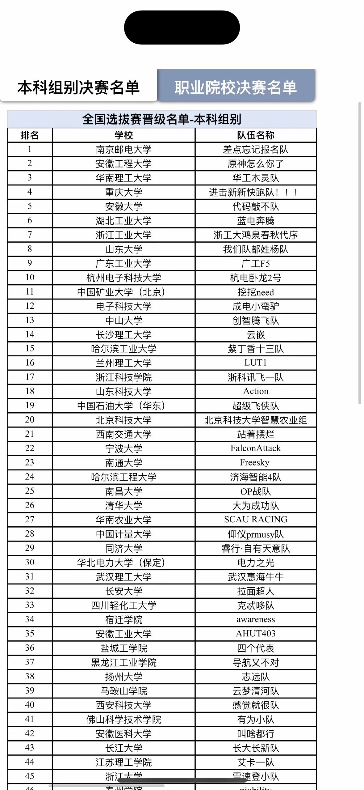
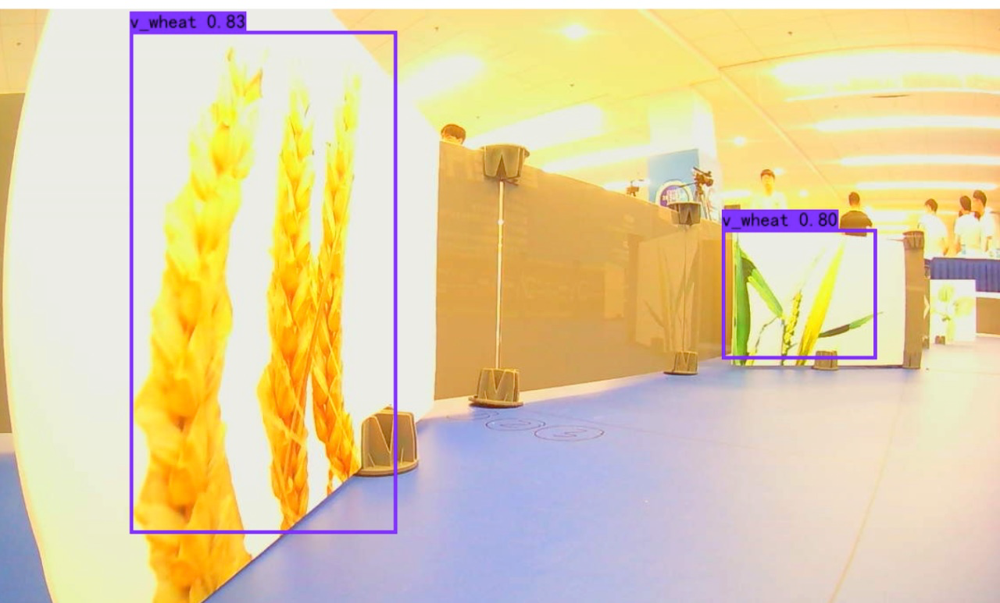
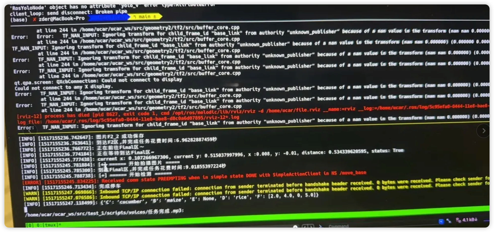

# 操作指令(启动+完赛

置信度调整，速度调整，代码调整
说明：代码的主要逻辑在 ./ucar_ws/src/test_1/scripts里面，有非常完备的导航逻辑与和识别进行衔接的逻辑

```bash
sudo jetson_clocks
```

第一启动

```bash
roslaunch ucar_nav Action_Nav.launch
```

```bash
cd /home/ucar/torch/yolov4-tiny-pytorch-master
python3 ros_node_v2.py
```

```bash
cd /home/ucar/ucar_ws/src/test_1/scripts
python2 Action_Nav.py
```

```bash
killcv   #杀死识别进程
```

决赛的最终修改如下：

sleep的时间太小了（频率不同步问题导致F区停车

1.M2跟M3点的测试

2.F区新策略测试（

3.锁的问题,频率改成0.1s，把check加锁

4.速度减慢（恢复，速度减慢

最终我们的成绩是预赛第一跑 满分 预赛排十八名 （预赛前车主板坏了，极限修车，太搞心态了

最终在决赛过程中里程计偏移的有点离谱，三次机会都g了，也是警示不要现场改代码，最后获得了国家三等奖，也算是告别了我的竞赛生涯了



十八届全国大学生智能汽车竞赛讯飞组别国三菜鸡开源（主要开源了导航逻辑与识别部分，我们做了数据增强所以识别起来很稳，以及通过雷达进行停车代码

感觉大家的识别策略大差不差 未开源的部分涉及到：1.TEB参数 2.语音唤醒（大家基本都会我就不开了

识别效果如下：



